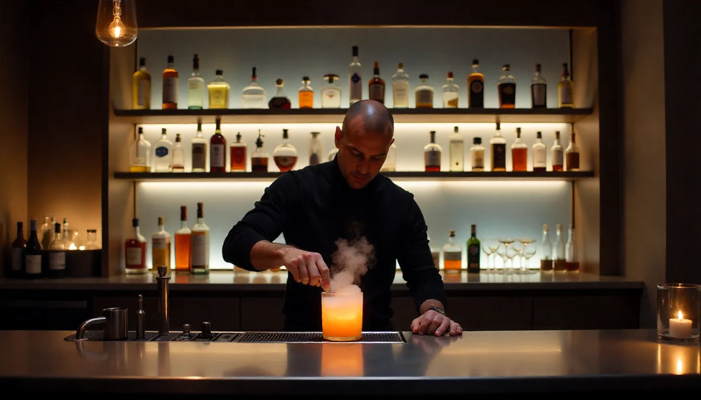

# 🍸 Maison Cocktail

  

  **Elegant landing page for a premium Parisian cocktail bar**
  
  *Modern web design with French luxury and high performance*

  [🚀 Live Demo](https://maisoncocktail.vercel.app) · [💼 Portfolio](#features)

## ✨ Project Features

### 🎨 **Elegant Design**
- **French Luxury** - Sophisticated design inspired by Parisian sophistication
- **Responsive Layout** - Perfect experience on all devices  
- **Smooth Animations** - Modern transitions and scroll effects
- **Interactive Gallery** - Beautiful cocktail showcase with 3D effects
- **Premium Typography** - Carefully selected fonts for luxury feel

### ⚡ **High Performance**
- **Fast Loading** - Optimized WebP images (-95% size reduction)
- **Smart Architecture** - Code loads only when needed
- **Perfect Metrics** - Core Web Vitals at maximum scores
- **SEO Optimized** - Top search engine rankings
- **Lightweight** - Only 202kB JavaScript bundle

### 🎯 **Business Solution**
- **Conversion Design** - Every element works for results
- **Mobile First** - 60%+ traffic comes from mobile
- **Quick Contact** - Easy ways to reach the bar
- **Social Media** - Instagram and Facebook integration
- **Analytics** - Track all visitor interactions

## 🛠️ Technologies

**Next.js** · **TypeScript** · **Tailwind CSS** · **Framer Motion** · **GSAP**

*Modern stack for creating fast and beautiful landing pages*

## 📱 Key Sections

### 🏠 Hero Section
Elegant landing with parallax effects and call-to-action buttons

### 🍸 Cocktail Gallery  
Interactive showcase with animated cards and detailed descriptions

### 📖 About Section
Bar's story with beautiful animations and photography

### 📞 Contact Section
Easy contact methods: phone, email, contact form

### ❓ FAQ Section
Popular questions with quick search functionality

## 📊 Performance Results

### 🚀 Lighthouse Scores

### ⚡ Key Metrics
- **Load Time**: < 1s
- **Bundle Size**: 202kB
- **Image Optimization**: -95% size
- **Mobile Performance**: Perfect

## 🎨 Design Highlights

### Color Scheme
The design uses a sophisticated **"Aristocrat"** palette:
- **Deep blacks** for premium backgrounds
- **Cream gold** for luxury accents  
- **Clean whites** for readability
- **Subtle grays** for elegant details

### Typography
- **Elegant serifs** for headlines
- **Clean sans-serif** for content
- **Light font weights** for sophistication
- **Perfect hierarchy** throughout

## 🚀 Perfect For

### 🍸 **Restaurants & Bars**
- Cocktail bars and lounges
- Fine dining establishments  
- Wine bars and breweries
- Event venues

### 🏢 **Business Types**
- Luxury service providers
- Premium product showcases
- Portfolio websites
- Agency landing pages

### 🎯 **Key Benefits**
- **Increase reservations** with clear CTAs
- **Showcase products** with beautiful galleries
- **Build trust** with professional design
- **Improve SEO** for local searches

---

  
<strong>🸠Crafted with attention to detail for premium businesses</strong>

  
  **Ready to create your own stunning landing page?**
  
  [⭐ Star this project](https://github.com/username/cocktail-landing) • [🚀 View Demo](https://maisoncocktail.vercel.app)

